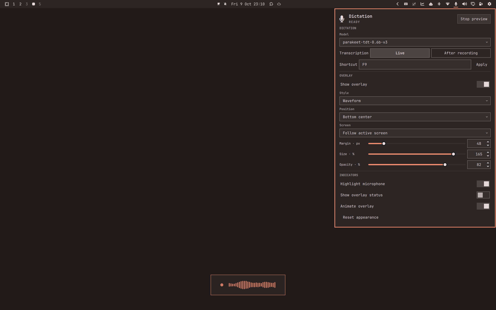

# Dictation for Omarchy

Turn your voice into text in your focused app. Dictation brings local speech
recognition to Omarchy, with live text insertion or transcription after recording.
Start and stop with one shortcut, and customize the recording indicator from a
native microphone panel. No account or cloud transcription service required.



*Dictation settings with a waveform preview.*

### Settings at a glance

| Area | Controls | What they do |
| --- | --- | --- |
| Dictation | Model | Select a compatible local speech model or download the recommended one. |
| Dictation | Transcription | Choose incremental **Live** output or insertion **After recording**. |
| Dictation | Shortcut · Apply | Set the global start/stop shortcut; Apply saves it after validation. |
| Overlay | Show overlay · Style | Show a waveform, compact indicator or pulsing circle while dictating. |
| Overlay | Position · Screen | Place the indicator; **Follow active screen** follows monitor focus, or choose a fixed screen. |
| Overlay | Margin · Size · Opacity | Adjust edge spacing, scale and transparency. |
| Indicators | Highlight microphone | Color the bar microphone during recording; required when the overlay is hidden. |
| Indicators | Show overlay status | Add a short status label to the recording indicator. |
| Indicators | Animate overlay | Make the indicator react to audio levels. |
| Panel | Preview | Try the appearance with simulated audio levels, without recording. |
| Panel | Reset appearance | Restore display defaults without changing the model, shortcut or transcription mode. |

## What it does

- **Live:** inserts text incrementally while you speak.
- **After recording:** transcribes and inserts text after you stop.
- **One configurable shortcut:** starts and stops dictation from other apps.
- **Local recognition:** no account or cloud transcription service.
- **Your preferred indicator:** waveform, compact or pulsing circle, with
  position, screen, size, opacity and animation controls.
- **Model setup in the panel:** download the recommended compatible model or
  select a compatible local folder.
- **Recovery when something fails:** retains incomplete dictations and offers
  actions to copy the latest text or open saved dictations.

## Current status

**0.2.0 — preview release.** Available for evaluation; not yet listed in the
plugin marketplace. A fresh Omarchy installation and broader speech testing
remain to be checked. See the [release checklist](docs/RELEASE_CHECKLIST.md)
for test results and remaining work.

## Install

Tested on **Omarchy 4.0.4, Hyprland 0.56.2 and Quickshell 0.3.1**, Linux x86_64.
Use Omarchy’s system `python3` to run setup. Setup uses `uv` to create a separate
Python 3.12 environment for speech recognition, downloading it if needed. You
also need PipeWire, a microphone and the tools listed in the
[user guide](docs/USER_GUIDE.md#requirements).

In a terminal in your logged-in Omarchy session:

```sh
git clone https://github.com/DomeMcFly/omarchy-dictation.git
cd omarchy-dictation
python3 setup.py check
python3 setup.py install
```

Setup installs the speech recognition service and microphone panel. It checks
required system tools and may download Python and supporting packages. If a
system tool is missing, setup tells you what to install before trying again.

Click the microphone icon in the Omarchy bar to open settings. Choose
**Download recommended** and wait for the model to load. This downloads the
approximately 2.55 GB Parakeet ONNX model. You can also select an existing
compatible model.
Supported model: **Parakeet TDT 0.6B v3 ONNX**. Other model formats are not
supported. The download begins only when you choose it in the panel.

F9 is used only when available. If it conflicts, choose an unused shortcut in
the panel. To reuse an existing Omarchy dictation shortcut, see
[shortcut conflicts](docs/USER_GUIDE.md#shortcut-conflicts).

**Installing through Omarchy still requires the setup command above.** Adding
the plugin alone does not install its speech recognition service.

## Use

1. Choose **Live** or **After recording** in the microphone panel.
2. Close the panel by clicking outside or clicking the microphone again.
3. Focus a text field and press your shortcut to start speaking.
4. Press the shortcut again to stop; wait for remaining text to finish.

**Ready** means the speech service and selected model are available and a
shortcut is set. You still need a working microphone and a selected text field.
**Preview** lets you adjust the overlay without recording.

## Important limits and privacy

Recognition runs locally. Text is inserted without sending Enter or automatically
changing the clipboard. Transcripts are kept locally until deleted; failed or
uncertain sessions also retain audio. There is currently no automatic retention
limit. See [storage and lifecycle](docs/USER_GUIDE.md#files-privacy-and-lifecycle).

Keep focus stable while text is being inserted. Live mode follows the focused
window, including pending words. After-recording output stops on a detected
window change, but text already being sent can still reach the next field.
Switching fields within the same window cannot be detected. With **Follow active
screen** selected, the overlay follows the active screen; a named screen stays
fixed. Neither setting can tell whether a text field is selected. Select an
editable field after switching tabs, windows or workspaces before continuing.
Typing outside a text field may trigger application shortcuts instead.

Punctuation comes from the recognition model and may interpret pauses as sentence
boundaries. Recognition accuracy and speed depend on speech and hardware.

## Update or remove

Finish any recording first. From the source directory after obtaining the new
version:

```sh
python3 setup.py update
omarchy restart shell
```

To uninstall, run this before deleting the source directory:

```sh
python3 setup.py uninstall
```

Models, settings and dictation history are retained. For plugins installed via
Omarchy's repository workflow, follow the additional
[update and removal steps](docs/USER_GUIDE.md#update-and-uninstall).

## Documentation and license

- [User guide](docs/USER_GUIDE.md): model support, statuses, shortcuts and storage.
- [Tests](docs/TESTING.md) and [release checklist](docs/RELEASE_CHECKLIST.md).
- [MIT license](LICENSE) and [third-party/model notices](THIRD_PARTY_NOTICES.md).

For source layout and release preparation, see [development notes](docs/TESTING.md#source-layout-and-release-export).
